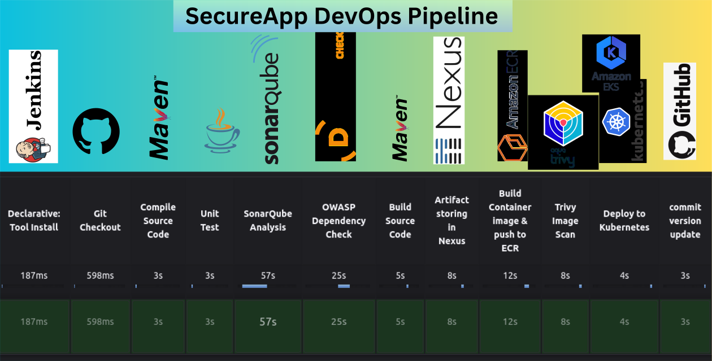

# Jenkins Pipeline for SecureShop Java App with Maven, Git, Trivy, SonarQube, Kubernetes, Nexus, ECR, Amazon EKS

## Overview

This project demonstrates the implementation of a complete CI/CD pipeline using Jenkins for a Java application. The pipeline automates the entire build, testing, security scanning, code quality analysis, containerization, and deployment process. The goal is to showcase proficiency in DevOps practices, tools, and technologies.

## Tools and Technologies

-  **Jenkins:** Building CI/CD Pipeline.
-  **Maven**: Build automation tool for Java projects
-   **Git**: Distributed Version Control System
-   **Trivy**: Vulnerability scanner for container images
-   **OWASP Dependency Check**: Identifies project dependencies and checks for known, publicly disclosed vulnerabilities
-   **SonarQube**: Continuous code quality and security analysis
-   **GitHub**: Cloud-based hosting service for Git repositories
-   **Nexus Artifact Repository**: Stores and distributes artifacts (e.g., libraries, dependencies)
-   **Amazon Elastic Container Registry (ECR)**: Fully-managed Docker container registry
-    **Amazon EKS:**    Container Orchestration Service (Elastic Kubernetes Service)
-   **Kubernetes**: Container orchestration platform for deployment

**Tools and server Configuration**

Before getting started I am going to create 3 EC2 ubuntu intances with proper security group for 3 defferent server (Jenkins, SonarQube, Nexus).  All of them with 4gb RAM and 2vCPU. 

**Expand Dropdown for Details Installation Guideline:**

<details>
<summary>Install Jenkins on Ubuntu Server</summary>
<br>
  
Update the package list
```bash
sudo apt update
```

Add Jenkins repository key

```bash
sudo wget -O /usr/share/keyrings/jenkins-keyring.asc \
https://pkg.jenkins.io/debian-stable/jenkins.io-2023.key
```

Then add a Jenkins apt repository entry:

```bash
echo deb [signed-by=/usr/share/keyrings/jenkins-keyring.asc] \
https://pkg.jenkins.io/debian-stable binary/ | sudo tee \
/etc/apt/sources.list.d/jenkins.list > /dev/null
```
Update the package list

```bash 
sudo apt update
```
Install Java (Jenkins requires Java)
```bash
sudo apt-get install fontconfig openjdk-17-jre -y
```
Add Jenkins repository to sources list
```bash
echo "deb http://pkg.jenkins.io/debian-stable binary/" | sudo tee -a /etc/apt/sources.list.d/jenkins.list
```
Update package list again to include Jenkins repository
```bash
sudo apt update
```
Install Jenkins
```bash
sudo apt install -y jenkins
```
Start Jenkins service
```bash
sudo systemctl start jenkins
```
Enable Jenkins to start on boot
```bash
sudo systemctl enable jenkins
```
Display initial Jenkins admin password
```bash
echo "Waiting for Jenkins to start..."
sleep 60 # Wait for Jenkins to fully start (adjust if needed)
```
Retrieve the initial admin password
```bash
JENKINS_PASSWORD=$(sudo cat /var/lib/jenkins/secrets/initialAdminPassword)
echo "Jenkins initial admin password: $JENKINS_PASSWORD"
echo "Access Jenkins at http://your-server-ip:8080"
```
Open the firewall to allow access to Jenkins
```bash
sudo ufw allow 8080
```
Display Jenkins status
```bash
sudo systemctl status jenkins | cat
```
</details>


<details>
<summary>Install Nexus Artifact Repository on Ubuntu Server</summary>
<br>
  
Create Ubuntu Server (Droplet) - min 4GB RAM & 2 CPUs
Open SSH port 22, 8081
  
#### Nexus Installation Guide on Ubuntu

Update the package list:

```bash
sudo apt update
``` 
Install OpenJDK 8:

```bash 
sudo apt install openjdk-8-jre-headless
``` 
Install net-tools:
```bash 
sudo apt install net-tools
``` 
Navigate to the `/opt` directory:
```bash
cd /opt
``` 
Download and extract Nexus:
```bash
sudo wget https://download.sonatype.com/nexus/3/latest-unix.tar.gz
sudo tar -zxvf latest-unix.tar.gz
``` 
Create a Nexus user:
```bash
sudo adduser nexus
``` 
Set ownership for Nexus directories:
```bash
sudo chown -R nexus:nexus nexus-3.28.1-01
sudo chown -R nexus:nexus sonatype-work
``` 
Edit Nexus runtime configuration:
```bash
sudo vim nexus-3.28.1-01/bin/nexus.rc
```
Inside `nexus.rc`, set the `run_as_user` variable to `"nexus".`
```bash
run_as_user="nexus"
```
Save and exit the editor.

Switch to the Nexus user:
```bash
sudo su - nexus
``` 
Start Nexus:
```bash 
/opt/nexus-3.28.1-01/bin/nexus start
```
Check Nexus process status:
```bash
ps aux | grep nexus
```
Check Nexus port status:
```bash
netstat -lnpt
``` 
Now, Nexus should be up and running on your Ubuntu system. You can access the Nexus web interface by navigating to `http://your_server_ip:8081` in a web browser.
</details>

<details>
<summary>Install SonarQube on Ubuntu Server</summary>
<br>
  
**Pull SonarQube Image:**
     
```bash
    docker pull sonarqube
```
**Create Docker Network:**
    
```bash
    docker network create sonar-network
```
**Run PostgreSQL Database Container:**
```bash
    docker run -d --name sonar-db --network sonar-network \
    -e POSTGRES_USER=sonar \
    -e POSTGRES_PASSWORD=sonar \
    -e POSTGRES_DB=sonar \
    postgres:9.6
```
 -   `-d`: Detached mode, run container in the background.
 -   `--name sonar-db`: Assign a name to the container.
 -   `--network sonar-network`: Connect container to the created network.
 -   `-e POSTGRES_USER=sonar`: Set PostgreSQL username to 'sonar'.
 -   `-e POSTGRES_PASSWORD=sonar`: Set PostgreSQL password to 'sonar'.
 -   `-e POSTGRES_DB=sonar`: Create a database named 'sonar' in PostgreSQL.
 
 **Run SonarQube Container:**
    
```bash
    docker run -d --name sonar -p 9000:9000 --network sonar-network \
    -e SONARQUBE_JDBC_URL=jdbc:postgresql://sonar-db:5432/sonar \
    -e SONAR_JDBC_USERNAME=sonar \
    -e SONAR_JDBC_PASSWORD=sonar \
    sonarqube
```
    
   -   `-d`: Detached mode, run container in the background.
    -   `--name sonar`: Assign a name to the SonarQube container.
    -   `-p 9000:9000`: Map container's port 9000 to host's port 9000.
    -   `--network sonar-network`: Connect container to the created network.
    -   `-e SONARQUBE_JDBC_URL=jdbc:postgresql://sonar-db:5432/sonar`: Set JDBC URL to connect SonarQube to the PostgreSQL database.
    -   `-e SONAR_JDBC_USERNAME=sonar`: Set SonarQube's database username.
    -   `-e SONAR_JDBC_PASSWORD=sonar`: Set SonarQube's database password.
    
 **Access SonarQube:**
 After running the container, you can access SonarQube by navigating to `http://localhost:9000` in your web browser. The default credentials are:
 - Username: admin
 - Password: admin

This setup will allow you to use SonarQube for static code analysis on your projects with the PostgreSQL database backend.


</details>

## Creating EKS Cluser
First Create a vpc with this CloudFormation stack: 
**To create your VPC**
Open the AWS CloudFormation console at [https://console.aws.amazon.com/cloudformation](https://console.aws.amazon.com/cloudformation/). From the navigation bar, select an AWS Region that supports Amazon EKS. Choose  **Create stack**,  **With new resources (standard)**. Under  **Prerequisite - Prepare template**, make sure that  **Template is ready**  is selected and then under  **Specify template**, select  **Amazon S3 URL**. You can create a VPC that supports only  `IPv4`, or a VPC that supports  `IPv4`  and  `IPv6`. Paste  one of the following URLs  into the text area under  **Amazon S3 URL**  and choose  **Next**:
  S3 URL: 
        ``` https://s3.us-west-2.amazonaws.com/amazon-eks/cloudformation/2020-10-29/amazon-eks-vpc-private-subnets.yaml```

 

**Now create a EKS Cluster with required Roles and Policies.** 


## Creating CI/CD Pipelines with Jenkins
### Configure Jenkins with Plugins & Tools
**Plugins Installation**
Navigate to the Jenkins dashboard and go to "Manage Jenkins" > "Manage Plugins". Install the following plugins:

- **SonarQube Scanner Plugin:** Integrates Jenkins with SonarQube for code
analysis.
 - **Nexus Artifact Uploader:** Provides integration with Nexus Repository Manager for artifact management.
- **OWASP Dependency-Check**: Integrates OWASP ZAP for security scanning.
- **Config File Provider**: Ability to provide configuration file.(for nexus configuration)
- **Eclipse Temurin installer**: Provide an installer for the different JDK
- **Pipeline Maven Integration**: Configure Maven integration with Pipeline
- etc.


---
 **Configure Nexus:**
- Go to "Manage Jenkins" > "Configure System".
- Add Nexus repository manager configuration and credentials.


**Configure SonarQube**
- Go to "Manage Jenkins" > "Configure System".
 Add SonarQube server configuration and credentials.

**Configure EKS on Jenkins Server**
To configure Jenkins to connect to Kubernetes cluster: Please SSH into the Jenkins server and become Jenkins user, and proceed with the following steps:

1.  Install the AWS CLI and kubectl.
2.  Configure the AWS CLI with your AWS access key and secret access key.
3.  Once configured, execute the specified command.
--- 
### Outline the steps to create CI/CD pipelines with Jenkins
*Configuring Jenkins with necessary plugins and tools, setting up webhooks, and defining stages in the pipeline.*

**Create Jenkins Pipeline:**
- Webhook Setup: Set up a webhook in your Git repository to trigger Jenkins pipeline upon commits to the master branch.

### Pipeline Stages Definition

Create a Jenkinsfile in your project repository with the following stages:
- **Git Checkout:** Retrieve code from a Git repository (GitHub)
- **Compile Source Code:** Compile the application code.
- **Unit Test:** Execute unit tests using a testing framework (JUnit).
- **SonarQube Analysis:** Run SonarQube analysis for code quality checks.
- **OWASP Dependency Check:** Check for any vulnerabilities in dependencies.
- **Build Source Code** Build the application with Maven.
- **Artifact Storing in Nexus:** Publish the built artifact to Nexus repository.
- **Build Container Image and Push to ECR** Build and tag Docker image and store image on Amazon Elastic Container Registry.

- **Deploy the Application to EKS (Kubernetes):** Upon successful image push, deploy the application to a Kubernetes cluster managed by Amazon EKS. Utilize declarative manifests (YAML files) to define deployments, services, and ingresses for the application.
- **Commit version update:** CI Commit version bump for end infinite commit loop.
**trivy imgae:**


## Benefits

-   **Automated Processes**: The entire pipeline is automated, reducing manual effort and minimizing human errors.
-   **Continuous Integration**: Code changes are regularly built, tested, and analyzed, ensuring early detection of issues.
-   **Continuous Delivery**: The application is automatically deployed to a production-like environment (Kubernetes cluster) after passing all checks.
-   **Security and Quality Assurance**: The pipeline incorporates security scanning and code quality analysis, ensuring the application is secure and maintainable.
-   **Reproducibility**: The pipeline is version-controlled, allowing for easy collaboration and consistent builds across different environments.

## Conclusion

This project demonstrates proficiency in DevOps practices, tools, and technologies, including Jenkins, Maven, Git, Trivy, OWASP Dependency Check, SonarQube, Kubernetes, GitHub, Nexus Artifact Repository, and Amazon ECR. It showcases the ability to implement a complete CI/CD pipeline for a Java application, ensuring automation, security, quality, and efficient deployment.
